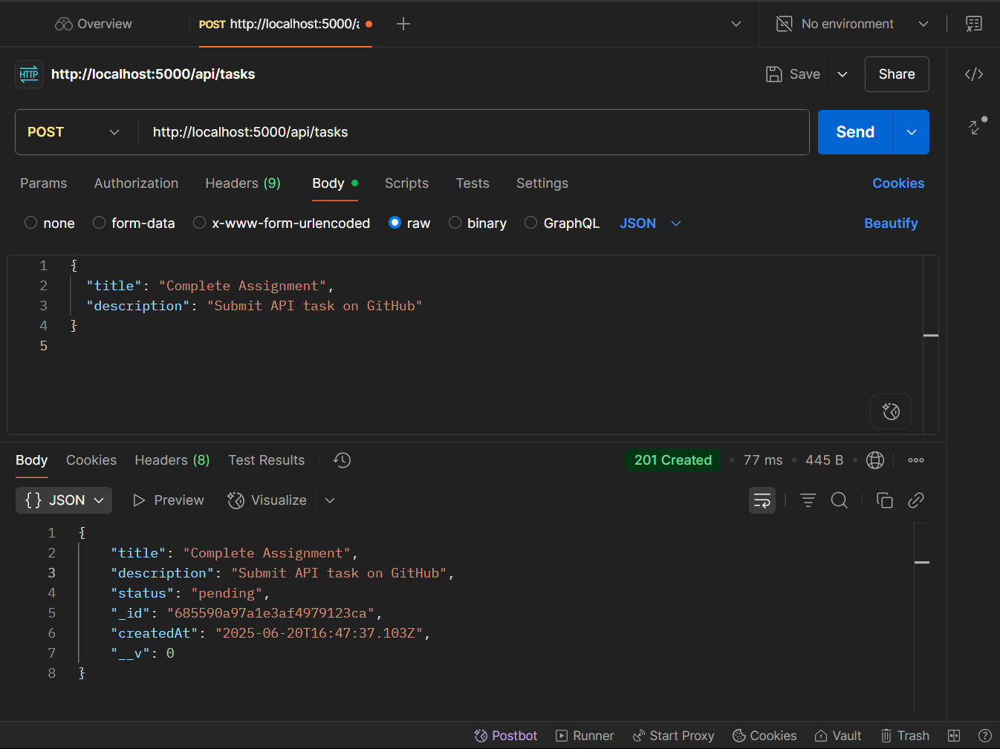
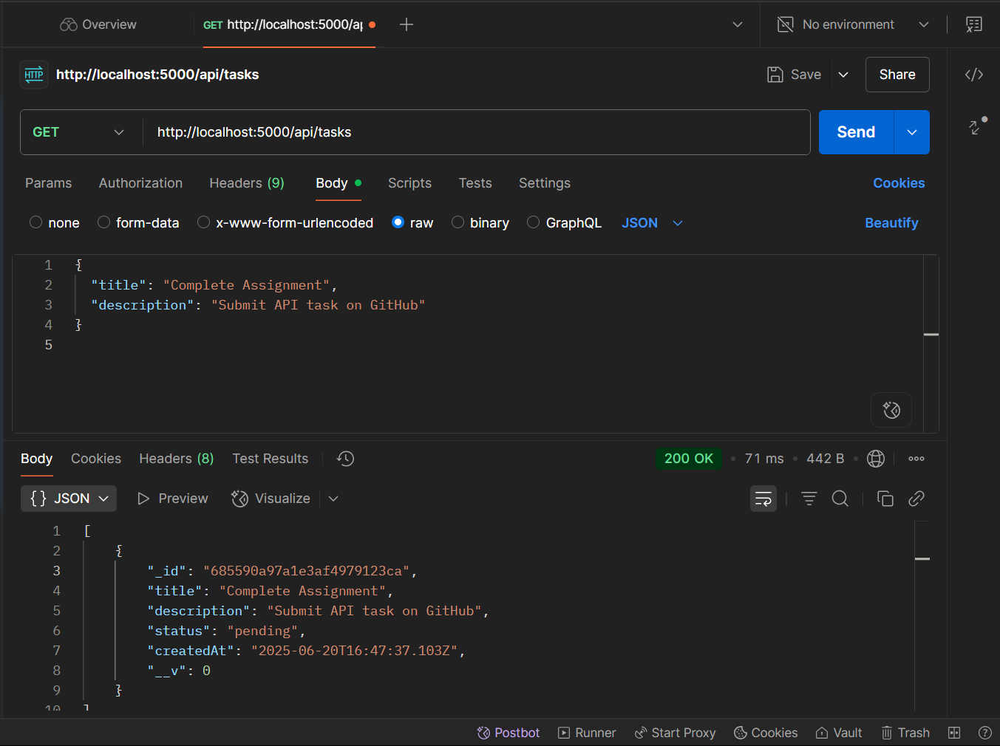
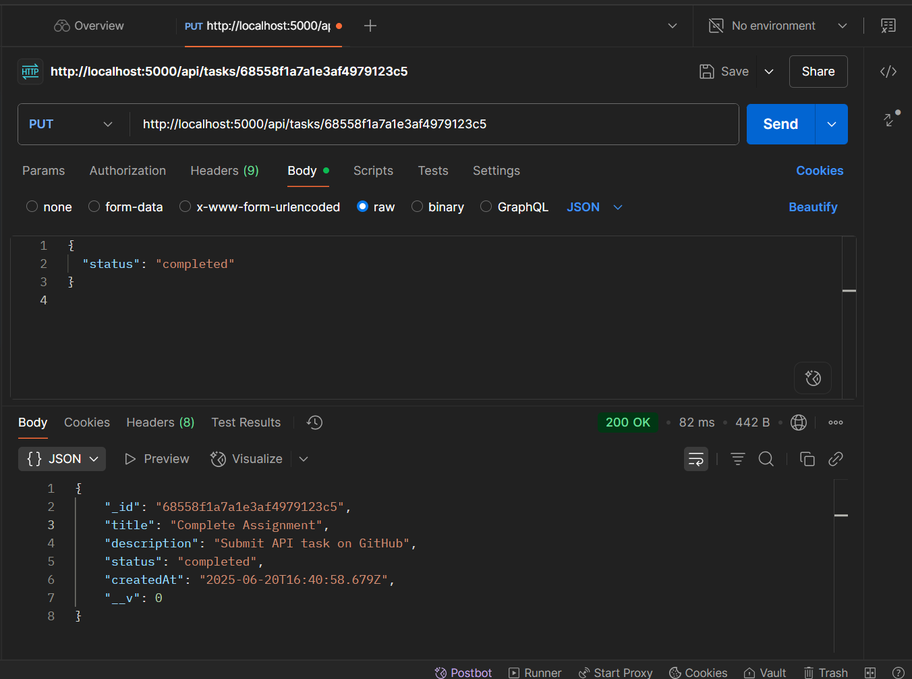
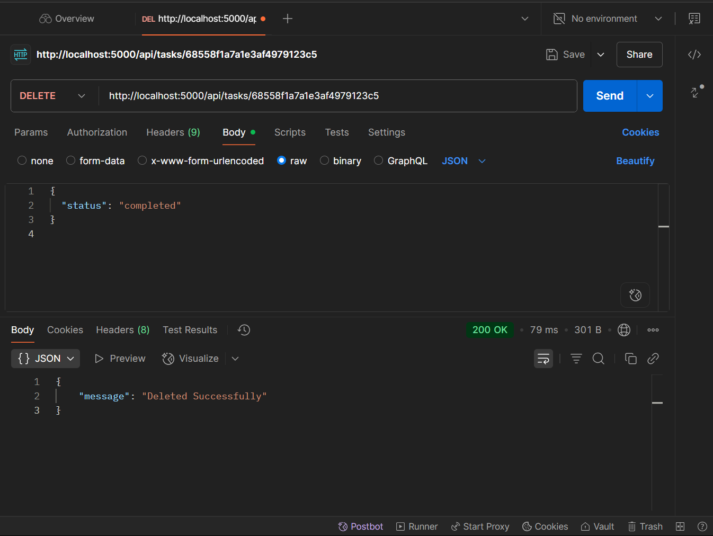
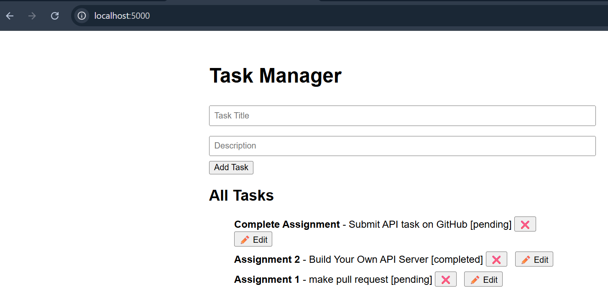
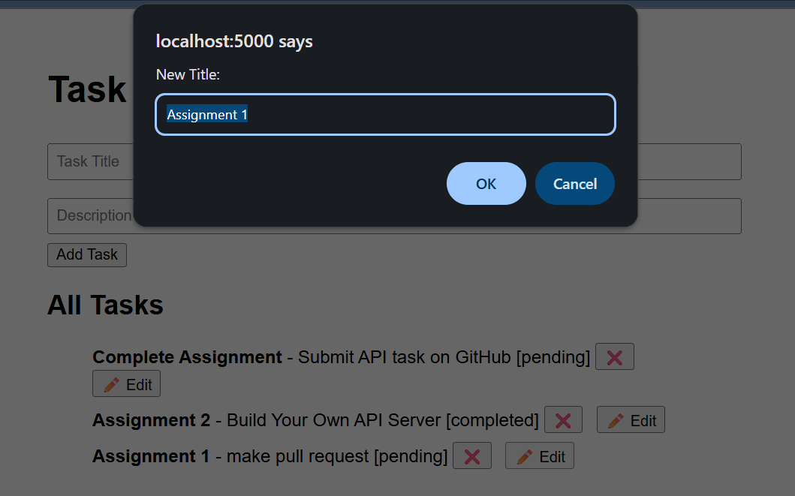
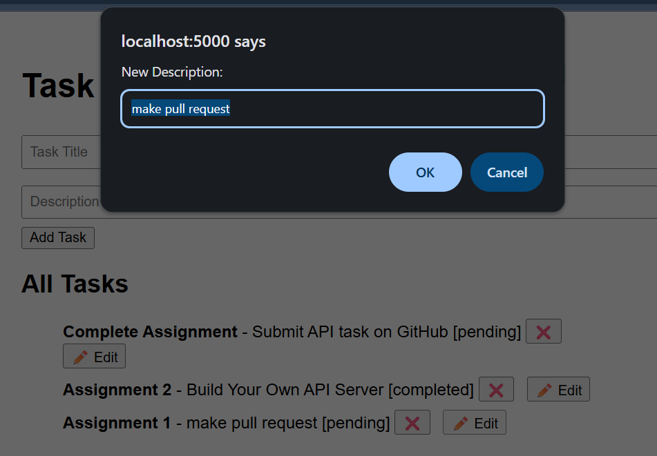
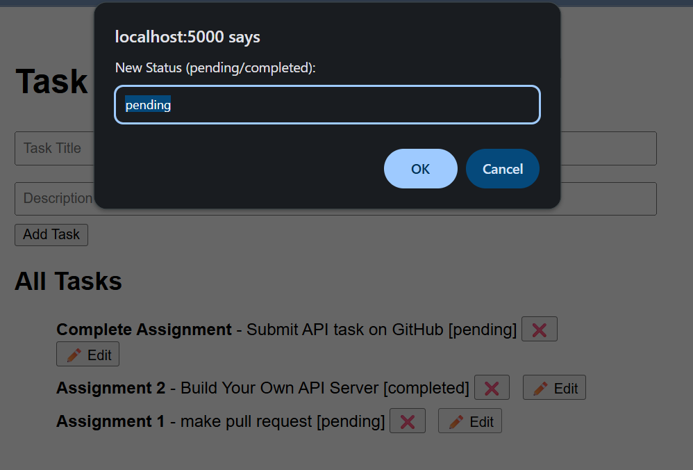

# 🚀 Task Manager API Server (Node.js + MongoDB + Express)

This is a custom API server built using **Node.js**, **Express**, and **MongoDB Atlas** to manage a task list with full **CRUD operations**. It also includes a simple **frontend web app** and was tested using **Postman**.

---

## 📸 Screenshots

### 🔹 Postman API Testing

1. **Create Task (POST)**
2. **Get All Tasks (GET)**
3. **Update Task (PUT)**
4. **Delete Task (DELETE)**

<p align="center">
  
  
  
  
</p>

---

### 🔹 Frontend Web Interface

1. Add new task  
2. View and update tasks  
3. Delete tasks

<p align="center">
  
  
  
  
</p>

---

## 📦 Technologies Used

- 🟢 Node.js  
- ⚡ Express.js  
- 🌿 MongoDB Atlas (Cloud DB)  
- 🧠 Mongoose (ODM)  
- 📮 Postman (API testing)  
- 💻 HTML/CSS/JS (Frontend)

---

## 🔧 Features

- ✅ Create a new task  
- ✅ View all tasks  
- ✅ Update any task (title, description, status)  
- ✅ Delete a task  
- ✅ Simple frontend interface to perform all operations  
- ✅ Tested via Postman

---

## 🚀 How to Run the Project Locally

### 1. Clone the Repository

```bash
git clone https://github.com/kmanishprogrammar/task-manager-api.git
cd custom-api-server
```

---

### 2. Install Dependencies

```bash
npm install
```

---

### 3. Set Up Environment Variables

Create a `.env` file in the root directory and add the following content:

```env
PORT=5000
MONGO_URI=mongodb+srv://admin:<your_password>@cluster0.mongodb.net/taskdb?retryWrites=true&w=majority
```

> Replace `<your_password>` with your actual MongoDB Atlas password.  
> Ensure your IP is whitelisted in MongoDB Atlas (0.0.0.0/0 for dev access).

---

### 4. Start the Server

```bash
node server.js
```

The backend will start running at:  
**http://localhost:5000**

---

### 5. Open the Frontend

Visit:  
**http://localhost:5000** in your browser to open the frontend.

You can now:
- ➕ Add new tasks  
- 👀 View all tasks  
- ✏️ Update task title/description/status  
- ❌ Delete tasks

---

## 📂 Project Structure

```
custom-api-server/
├── .env
├── server.js
├── models/
│   └── Task.js
├── routes/
│   └── taskRoutes.js
├── public/
│   ├── index.html
│   ├── script.js
│   └── style.css
├── screenshots/
│   ├── image1.png (Postman Create)
│   ├── image2.png (Postman Read)
│   ├── image3.png (Postman Update)
│   ├── image4.png (Postman Delete)
│   ├── image5.png (Frontend Add)
│   ├── image6.png (Frontend View)
│   ├── image7.png (Frontend Edit)
│   └── image8.png (Frontend Delete)
├── README.md
```

---

## ✍️ Author

**Manish Kumar**  
🎓 Final Year IT Student  
🔥 Custom API Server Project  
📮 Tested using Postman + Fully Functional Frontend

---

